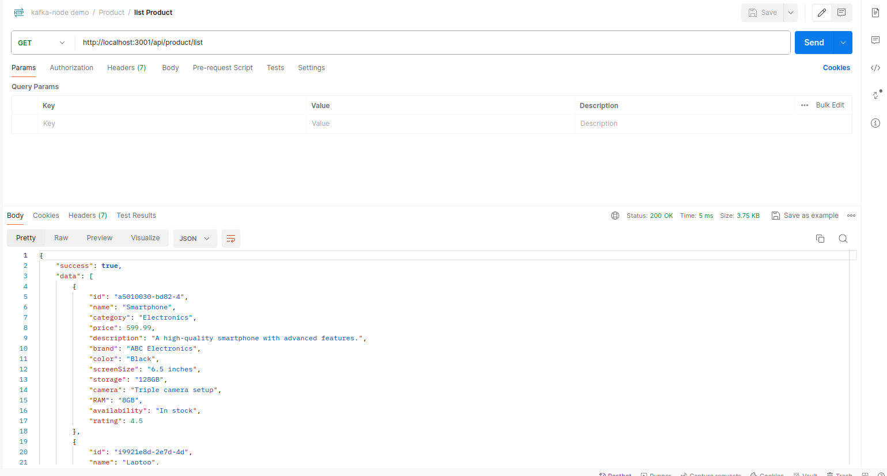

# kafka-nodejs microservice

- This project implements microservices architecture using Node.js and Kafka for   communication between services.


### 📜 Features

- **Microservices Architecture:** Separation of concerns with distinct user and product services.
- **Kafka Integration:** Efficient inter-service communication using Apache Kafka.
- **Scalability:** Independent scalability of services.
- **Node.js:** Built with Node.js, leveraging its asynchronous capabilities for high performance.
- **Environment Configuration:** Configurable environment settings for development and production.

### 💼 Usages

- **User Management:** Registration and login functionalities for users.
- **Product Management:** Adding, listing, and managing products.
- **Service Communication:** Demonstrates the use of Kafka for message passing between microservices.
- **Scalable Architecture:** Example setup for scalable microservice architecture suitable for modern applications.
- **Learning Resource:** Great starting point for developers looking to understand microservices with Node.js and Kafka.

---

### 📂 Directory Structure

    ├── 📝 README.md               # Project description
    
    └── 📂 app/                    # Main application directory
    
        ├──📂 user/                # user services
    
            ├──🚀 server.js        # Entry point for the server
    
        ├──📦 package.json         # Project configuration and dependencies
        
        ├──🔐 package-lock.json    # Auto-generated by npm package manager
    
        ├── ⚙️ .env-example         # Sample environment variables (rename to .env)
           
        ├──📂 product/             # product services
    
            ├──🚀 server.js        # Entry point for the server
    
        ├──📦 package.json         # Project configuration and dependencies
    
        ├──🔐 package-lock.json    # Auto-generated by npm package manager
        
        ├── ⚙️ .env-example         # Sample environment variables (rename to .env)
    
---


## 🚀 Getting Started

### 📝 Description

This project showcases the implementation of microservices architecture for user and product management using Node.js. It consists of two main services:

#### User Service

The user service manages user-related operations, including user registration and login functionalities.

#### Product Service

The product service is responsible for handling product-related tasks, such as adding new products and listing existing ones.

Communication between services is facilitated through Apache Kafka, ensuring seamless integration and efficient data exchange.

### 🛠 Setup in System

To set up Kafka in your ubuntu system, follow these steps:

1. **Download Apache Kafka:** Visit the [Apache Kafka downloads page](https://kafka.apache.org/downloads) and download the latest stable release. 
   Choose the binary option (tgz or zip file) appropriate for your operating system.

2. **Extract Kafka:** Once the download is complete, extract the contents of the downloaded file to a directory of your choice.

3. **Navigate to Kafka Directory:** Open a terminal and navigate to the directory where you extracted Kafka.

4. **Check if Java is Installed:** Run `java -version`. If Java is not installed, Install it using:
    ```bash
    sudo apt update
    sudo apt install default-jdk
    ```

5. **Set JAVA_HOME Environment Variable:** Find out where Java is installed by running `update-alternatives --config java`. 
   Then, set the `JAVA_HOME` environment variable by adding the following lines to your `~/.bashrc` file (or `~/.zshrc` if you are using Zsh):
    ```bash
    export JAVA_HOME=/usr/lib/jvm/java-11-openjdk-amd64
    export PATH=$JAVA_HOME/bin:$PATH
    ```

6. **Reload the Shell Configuration:** Use the command `source ~/.bashrc` or `source ~/.zshrc` to reload the shell configuration.

7. **Start Zookeeper and Kafka Server:**
    - Start Zookeeper using: `bin/zookeeper-server-start.sh config/zookeeper.properties`
    - Start Kafka server using: `bin/kafka-server-start.sh config/server.properties`


### 💻 Steps to Run Code  

For development:

1. **Install Dependencies:**

    **Navigate to the `app/user` Directory:**
    Run `npm install`.

    **Navigate to the `app/product` Directory:**
    Run `npm install`.

2. **Configure Environment Variables(optional):** Rename `.env-example` to `.env`.

3. **Start the Services:**
    - Navigate to the `app/user` Directory: `npm run start:user`.
    - Navigate to the `app/product` Directory: `npm run start:product`
---    


## User Kafka Microservices Screenshots


This screenshot shows the login interface for the User microservices.


This screenshot displays the user listing interface for the User microservices.

----

## Product Kafka Microservices Screenshots


This screenshot illustrates the interface for adding a product in the Product microservices.



This screenshot showcases the product listing interface for the Product microservices.

----

Now you're all set to build awesome kafka microservices architecture! 🌟

For more details, visit MultiQoS.[https://multiqos.com/]

Contact us for collaboration or support:

Email: biz@multiqos.com